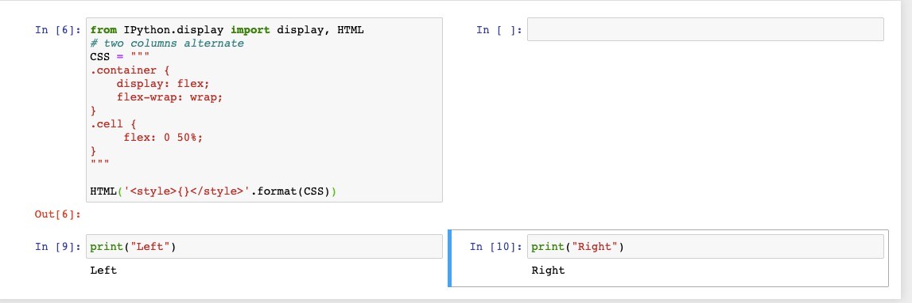
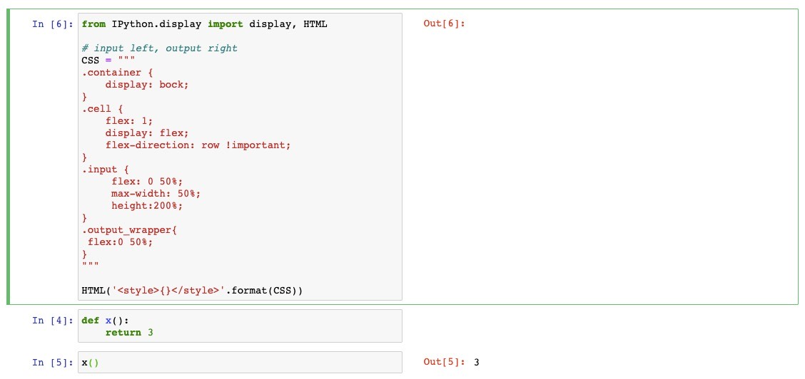

# Optimize Python code
See this file [here](Optimize%20Python%20Code.ipynb)

# Jupyter Notebook Hacks
## Jupyter Notebook Auto-reload modules
Add to the top of the notebook:
```python
%load_ext autoreload
%autoreload 2
```

## Notebook cells in 2 columns
```python
from IPython.display import display, HTML
# two columns alternate
CSS = """
.container {
    display: flex;
    flex-wrap: wrap;
}
.cell {
     flex: 0 50%;
     max-width: 50%;
}
"""

HTML('<style>{}</style>'.format(CSS))
```


output:



## Notebook in/out side-by-side
```python
from IPython.display import display, HTML

# input left, output right
CSS = """
.container {
    display: bock;
}
.cell {
    flex: 1;
    display: flex;
    flex-direction: row !important;
}
.input {
     flex: 0 50%;
     max-width: 50%;
     height:200%;
}
.output_wrapper{
 flex:0 50%;
}
"""

HTML('<style>{}</style>'.format(CSS))

```

output:


## Logging to a DB:
See [this](https://stackoverflow.com/questions/2314307/python-logging-to-database)

## Nested sub-parsers
```python
def foo_bar():
  print('Foobar')

parser = argparse.ArgumentParser(prog='app')
subparsers = parser.add_subparsers()

foo = subparsers.add_parser('foo')
foo_subparsers = foo.add_subparsers()

bar = foo_subparsers.add_parser('bar')
bar.set_defaults(func=foo_bar)

args = parser.parse_args()
args.func(args)
```

# I/O
## Calling a sys call in memory
```python
from subprocess import Popen, PIPE, STDOUT

bytz = zf.read(f)
p = Popen(['pdftotext',  '-layout',   '-', '-' ], stdout=PIPE, stdin=PIPE, stderr=STDOUT)
stdout = p.communicate(input=bytz)[0]
text = stdout.decode()
```

# Debuggin and auditing
## Traceback
```python
import traceback 
try:
  ...
except Exception as e:
  traceback.print_stack()
  traceback.print_exc()
```

## Get function caller
```python
import inspect
...
def f():
    curframe = inspect.currentframe()
    calframe = inspect.getouterframes(curframe, 2)
    print('caller name:', calframe[1][3])
```

# Python External Tools
## pyinstaller
In case of `os.fspath()` error, try:

`LD_LIBRARY_PATH=${CONDA_PREFIX}/lib pyinstaller file.spec`

## SSL Issues with pip install

`pip --trusted-host pypi.python.org --trusted-host files.pythonhosted.org --trusted-host pypi.org install <pkg>`

## PyEnv
If Pyenv failed to install python 3.7.X because of ModuleNotFoundError: No module named 'pyexpat', try:
`
SDKROOT=/Applications/Xcode.app/Contents/Developer/Platforms/MacOSX.platform/Developer/SDKs/MacOSX10.14.sdk MACOSX_DEPLOYMENT_TARGET=10.14 pyenv install 3.7.4
`

## Enable framework with PyEnv

`env PYTHON_CONFIGURE_OPTS="--enable-framework"`


## Calling C/C++ code from Python

[Calling C/C++ from Python?](https://stackoverflow.com/questions/145270/calling-c-c-from-python)


